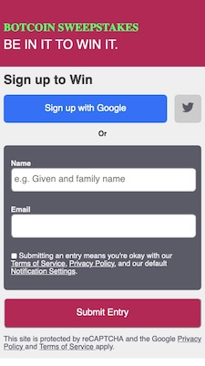

# DailyUI - Signup Page Challenge - Day001

This is a solution to the Signup page challenge on [DailyUI](https://www.DailyUI.co).

## Table of contents

- [Overview](#overview)
  - [The challenge](#the-challenge)
  - [Screenshot](#screenshot)
  - [Links](#links)
- [My process](#my-process)
  - [Built with](#built-with)
  - [What I learned](#what-i-learned)
  - [Continued development](#continued-development)
  - [Useful resources](#useful-resources)
- [Author](#author)

## Overview

Create a sign up page, modal, form, or app screen related to signing up for something. It could be for a volunteer event, contest registration, a giveaway, or anything you can image. A mobile-first workflow should be followed along with a fully responsive design - as a self-inflicted bonus.

### The challenge

Users should be able to:

- Enter their name and email address to signup for a competition;
- Tap a button for an automated signup ie Signup with Apple, Google or Twitter.

### Screenshot



### Links

- Solution URL: [https://github.com/Will-1-Am/Will-1-Am.github.io/tree/master/dailyui/001 - SignupPage](https://github.com/Will-1-Am/Will-1-Am.github.io/tree/master/dailyui/001 - SignupPage)
- Live Site URL: [https://github.com/Will-1-Am/Will-1-Am.github.io/tree/master/dailyui/001 - SignupPage/index.html](https://github.com/Will-1-Am/Will-1-Am.github.io/tree/master/dailyui/001 - SignupPage/index.html)

## My process

### Built with

- Semantic HTML5 markup
- CSS custom properties
- Flexbox layout
- Mobile-first workflow

### What I learned

Customising a button with a logo icon from [fontawesome](https://fontawesome.com) is not that difficult - check-out the resources list below for more information.
It seemed intuitive for this design to include some kind of Google/Apple signin feature and to use flexbox to layout the buttons.  In this case, the Google signin feature is arbitrarily chosen as the method of choice for our user and this is reflected in the size of the button presented.
Initially, the Google and Twitter buttons were stuck together and for quickness I thought of just throwing a letter in with the same colouring as the page background to serve as a spacer.

```html
<p class="button-spacer"> X </p>
```
The corresponding styling for the spacer follows:
```css
.button-spacer {
  color: var(--very-light-grey);
}
```
There must be an easier and more elegant way, I thought, and low and behold...
...if a margin is added to the "twitter-button" element all is resolved - as long as enough space is available.
```css
.twitter-button {
  color: var(--grey);
  background-color: var(--light-grey);
  flex: 0;
  padding: 1rem;
  margin-left: 1rem;
}
```
The HTML and CSS code can then be cleaned-up accordingly.

### Continued development

It will be very interesting to integrate signin services properly into a production page and the [Useful resources](#useful-resources) section below includes several links regarding this feature.  I also created a [pen](https://codepen.io/will-1-am-the-Iceman/pen/BaWBdjV) containing some test code in order to visualise the different button types available.

Also the design at the largest screen width is truncated and could deal with this better.  While it does not impinge on the site functionality it is more of a niggle and therefore a commensurate priority, but nonetheless something I would like to perfect.

### Useful resources

- [How to Add Font Awesome Icons to Your Buttons](https://www.freecodecamp.org/news/how-to-add-font-awesome-icons-to-your-buttons/) - This helped me with the basics for applying an icon to a button.
- [The Input (Form Input) element](https://developer.mozilla.org/en-US/docs/Web/HTML/Element/input) - This is an amazing article which helped me understand the Form input element. I'd recommend it to anyone still learning this concept.
- [Building a custom Google Sign-In button](https://developers.google.com/identity/sign-in/web/build-button) - In addition to guidance for creating a custom button for a Google signin, a link can be found here for all of the basics required to integrate Google Sign-in.
- [Displaying Sign in with Apple Buttons](https://developer.apple.com/documentation/sign_in_with_apple/sign_in_with_apple_js/displaying_sign_in_with_apple_buttons)
- [Basic concepts of flexbox](https://developer.mozilla.org/en-US/docs/Web/CSS/CSS_Flexible_Box_Layout/Basic_Concepts_of_Flexbox) - This page contains some great information about flexbox and how to configure one, distribute space, align items and much more.
- [Aligning Items in a Flex Container](https://developer.mozilla.org/en-US/docs/Web/CSS/CSS_Flexible_Box_Layout/Aligning_Items_in_a_Flex_Container) - This article was particularly useful for coding the space between the Google and Twitter buttons, but it also has a wealth of other information.

## Author

- Website - [William Spanfelner](https://will-1-am.github.io)
- Frontend Mentor - [@Will-1-Am](https://www.frontendmentor.io/profile/@Will-1-Am)
- Twitter - [@WSpanfelner](https://www.twitter.com/WSpanfelner)
