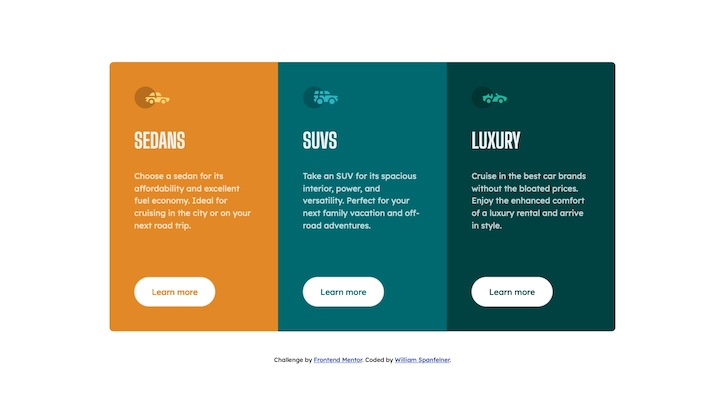

# Frontend Mentor - 3-column preview card component solution

This is a solution to the [3-column preview card component challenge on Frontend Mentor](https://www.frontendmentor.io/challenges/3column-preview-card-component-pH92eAR2-). Frontend Mentor challenges help you improve your coding skills by building realistic projects. 

## Table of contents

- [Overview](#overview)
  - [The challenge](#the-challenge)
  - [Screenshot](#screenshot)
  - [Links](#links)
- [My process](#my-process)
  - [Built with](#built-with)
  - [What I learned](#what-i-learned)
  - [Continued development](#continued-development)
  - [Useful resources](#useful-resources)
- [Author](#author)
- [Acknowledgments](#acknowledgments)

## Overview

- This is a solution to the issue of jumping or mis-aligned buttons caused when the description text resizes due to its container becoming narrower (as can be observed at Live Site URL: [https://will-1-am.github.io/frontend-Mentor/3-column-preview-card-component-main/index.html](https://will-1-am.github.io/frontend-Mentor/3-column-preview-card-component-main/index.html)).  The solution utilizes the grid-template-area feature of the CSS grid layout system.


### The challenge

Users should be able to:

- View the optimal layout depending on their device's screen size
- See hover states for interactive elements

### Screenshot




### Links

- Solution URL: [https://github.com/Will-1-Am/Will-1-Am.github.io/tree/master/frontend-Mentor/3-column-preview-card-component-main-GTA](https://github.com/Will-1-Am/Will-1-Am.github.io/tree/master/frontend-Mentor/3-column-preview-card-component-main-GTA)
- Live Site URL: [https://will-1-am.github.io/frontend-Mentor/3-column-preview-card-component-main-GTA/index.html](https://will-1-am.github.io/frontend-Mentor/3-column-preview-card-component-main-GTA/index.html)

## My process

It seemed natural to want the buttons to remain aligned regardless of what occurred with the text above it.  Reviewing the [grid-template-areas](https://developer.mozilla.org/en-US/docs/Web/CSS/grid-template-areas) property and the examples on the MDN site, gave me the inspiration to try a solution using this technique for the 3-column-preview-card-component challenge and led to the creation of [my grid-template-areas CodePen](https://codepen.io/will-1-am-the-Iceman/pen/qBRwJza) for this approach.

### Built with

- Semantic HTML5 markup
- CSS custom properties
- Flexbox
- CSS Grid
- Mobile-first workflow

### What I learned

Named row and columnm areas can be created in the parent container for its child items to "drop" into ostensibly.  The names for the areas, can be conjured arbitrarily, but ideally should reflect their purpose. This document needs to present four rows of content of varying heights due to the design specification.  The row-heights are specified individually using the grid-template-rows property.  The HTML might look something like the following:

```html
    <article class="card sedans">
        <header>
		 
        </header>
        <h2>Sedans</h2>
        <p>This card refers to a particular subject, the contents of which have not been disclosed.</p>
        <div class="lm-button">
          <a href="#" class="button">Learn more</a>
        </div>
    </article>
```
The corresponding CSS might have a selector defined as follows:

```css
.card {
  display: grid;
  width: 100%;
  grid-template-areas: "head "
                       "heading  "
                       "desc "
                       "button ";
  grid-template-rows: 9.5rem 3rem auto 6rem;
}
```

Special formatting can now be applied to the grid-template-areas by selecting the desired element or class as below.  Note the use of the ">" combinator used to select elements that are direct children.

```css
.card > .icon {
    grid-area: head;
    padding: 3rem;
    /* background-color: red; */
}
.card > .car-type-heading {
    grid-area: heading;
    padding: 0 3rem;
    /* background-color: white; */
}
.card > .car-type-description {
    grid-area: desc;
    padding: 0 3rem 3rem;
    /* background-color: grey; */
}
.card > .lm-button {
    grid-area: button;
    padding-left: 3rem;
}
```

It may be of interest to note that in the previous version of this challenge solution the icon images used in the head of each card was applied as a background-image.  Using the grid-template-area property seemed to preclude the use of background-images as they would not respond to padding or margin setting requests.  This necessitated the use of img or svg elements.

### Continued development

Understanding why background-images do not respond to padding and margin requests when laid out with grid-template-areas would be useful.

### Useful resources

- [CodePen](https://codepen.io) - CodePen is really useful for going back to basics. I go back to it continuously and will certainly use it going forward.
- [MDN Web Docs - Grid and flexbox](https://developer.mozilla.org/en-US/docs/Web/CSS/CSS_Grid_Layout/Relationship_of_Grid_Layout#grid_and_flexbox) - Compare grid and flex-box layout with examples.
- [MDN Web Docs - CSS values and units](https://developer.mozilla.org/en-US/docs/Learn/CSS/Building_blocks/Values_and_units) - This is an amazing resource which helped me understand rem units better. I'd recommend it to anyone still learning this concept.
- [Center a grid container vertically and horizontally](https://stackoverflow.com/questions/46469127/center-a-grid-container-vertically-and-horizontally) - A little nudge is sometimes all it takes to remember something and this nugget helped me to get things centered.
- [Grid by Example](https://gridbyexample.com/video/series-define-a-grid/) - Grids can be a little tricky, and this handy link helped me loads.
- [What does > in CSS mean?](https://stackoverflow.com/questions/1628485/what-does-in-css-mean)
- [Using CSS custom properties (variables)](https://developer.mozilla.org/en-US/docs/Web/CSS/Using_CSS_custom_properties) - Variables can help make your CSS more readable and easier to manage.  Check this link out for how to use variables in CSS.
- [Combinators](https://developer.mozilla.org/en-US/docs/Web/CSS/CSS_Selectors) - Special ways to select elements in CSS.
- [MDN Web Docs - grid-template-areas](https://developer.mozilla.org/en-US/docs/Web/CSS/grid-template-areas) - Check out the example code here for a little inspiration.

## Author

- Website - [William Spanfelner](https://will-1-am.github.io)
- Frontend Mentor - [@Will-1-Am](https://www.frontendmentor.io/profile/@Will-1-Am)
- Twitter - [@WSpanfelner](https://www.twitter.com/WSpanfelner)

## Acknowledgments

Hat tip to @brasspetals who provided truly inspiring tips and advice. Thank you.