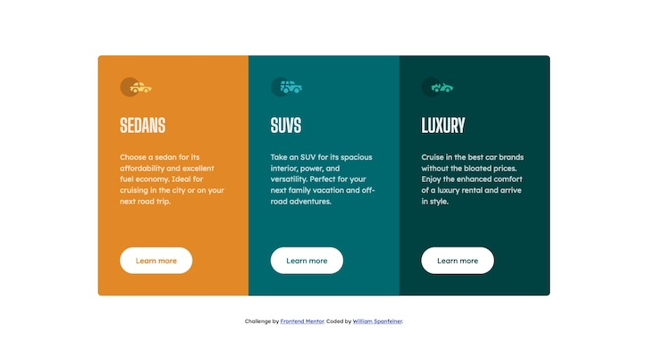

# Frontend Mentor - 3-column preview card component solution

This is a solution to the [3-column preview card component challenge on Frontend Mentor](https://www.frontendmentor.io/challenges/3column-preview-card-component-pH92eAR2-). Frontend Mentor challenges help you improve your coding skills by building realistic projects. 

## Table of contents

- [Overview](#overview)
  - [The challenge](#the-challenge)
  - [Screenshot](#screenshot)
  - [Links](#links)
- [My process](#my-process)
  - [Built with](#built-with)
  - [What I learned](#what-i-learned)
  - [Useful resources](#useful-resources)
- [Author](#author)
- [Acknowledgments](#acknowledgments)

## Overview

### The challenge

Users should be able to:

- View the optimal layout depending on their device's screen size
- See hover states for interactive elements

### Screenshot




### Links

- Solution URL: [https://github.com/Will-1-Am/Will-1-Am.github.io/tree/master/frontend-Mentor/3-column-preview-card-component-main](https://github.com/Will-1-Am/Will-1-Am.github.io/tree/master/frontend-Mentor/3-column-preview-card-component-main)
- Live Site URL: [https://will-1-am.github.io/frontend-Mentor/3-column-preview-card-component-main/index.html](https://will-1-am.github.io/frontend-Mentor/3-column-preview-card-component-main/index.html)

## My process

### Built with

- Semantic HTML5 markup
- CSS custom properties
- Flexbox
- CSS Grid
- Mobile-first workflow

### What I learned

Intuitively, this 3 Column Preview Card Component project seemed perfectly suited to a grid type CSS layout since a mixture of columns and rows is required to acheive the design specification.  It could be argued that a nested grid layout might be useful, something like:

```html
<div class="cards">
  <div class="card cardA">Card A</div>
    <div class="card-content icon a ">Icon A</div>
    <div class="card-content heading">Heading A</div>
    <div class="card-content description">Description A</div>
    <div class="card-content button">Button A</div>
  <div class="card cardB">Card B</div>
  <div class="card cardC">Card C</div>
</div>
```
The CSS code for a grid layout might look as follows, assuming a mobile first approach:

```css
.cards {
  width: 330px;
  margin: 3rem auto;
  border: solid 1px;
  border-radius: 0.5rem;
  display: grid;
}

.card {
  width: 330px;
  display: grid;
  grid-template-rows: repeat(3, 1fr);
  border-bottom: solid 1px;
  padding: 1rem;
}

.card-content {
  padding: 0.5rem 2rem;
}
```

Essentially, the parent container is assigned the grid display type and the child containers fall into the grid.

The nicely rounded corners of the cards container might disappear when a background-color is applied.  The overflow selector can resolve the missing rounded corners by setting overflow to hidden in the parent container.

e.g. 

```css
.cards {
	.
	.
	.
  overflow: hidden;
}
```

Finally, a flex-box layout was chosen for centering the 3 Column Preview Card Component for the desktop design specification. If the design is simplified into one column design of the cards grid and attribute text, all of the body contents can be wrapped in a div tag as below:

```html
<div class="centering-wrapper">
  <div class="box">
    <strong>This is the best box ever!!!</strong>
  </div>

  <div class="text">by <a href="https://will-1-am.github.io"> Will-1-am</a></div>
</div>
```

```css
strong {
  font-family: sans-serif;
  font-size: 30px;
  text-align: center;
}
.box {
  color: #fff;
  background-color: red;
  width: 20rem;
  height: 10rem;
  text-align: center;
}
.centering-wrapper {
  display: flex;
  flex-flow: column;
  justify-content: center;
  align-items: center;
  min-height: 100vh;
}
```


### Useful resources

- [CodePen](https://codepen.io) - CodePen is really useful for going back to basics. I go back to it continuously and will certainly use it going forward.
- [MDN Web Docs - Grid and flexbox](https://developer.mozilla.org/en-US/docs/Web/CSS/CSS_Grid_Layout/Relationship_of_Grid_Layout#grid_and_flexbox) - Compare grid and flex-box layout with examples.
- [MDN Web Docs - CSS values and units](https://developer.mozilla.org/en-US/docs/Learn/CSS/Building_blocks/Values_and_units) - This is an amazing resource which helped me understand rem units better. I'd recommend it to anyone still learning this concept.
- [Center a grid container vertically and horizontally](https://stackoverflow.com/questions/46469127/center-a-grid-container-vertically-and-horizontally) - A little nudge is sometimes all it takes to remember something and this nugget helped me to get things centered.
- [Grid by Example](https://gridbyexample.com/video/series-define-a-grid/) - Grids can be a little tricky, and this handy link helped me loads.
- [What does > in CSS mean?](https://stackoverflow.com/questions/1628485/what-does-in-css-mean)
- [Using CSS custom properties (variables)](https://developer.mozilla.org/en-US/docs/Web/CSS/Using_CSS_custom_properties) - Variables can help make your CSS more readable and easier to manage.  Check this link out for how to use variables in CSS.

## Author

- Website - [William Spanfelner](https://will-1-am.github.io)
- Frontend Mentor - [@Will-1-Am](https://www.frontendmentor.io/profile/@Will-1-Am)
- Twitter - [@WSpanfelner](https://www.twitter.com/WSpanfelner)

## Acknowledgments

Hat tip to @grace-snow who has provided amazing support, tips and advice. Thank you.  Another hat tip goes to @mattstuddert for creating this awesome readme template.
